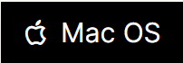
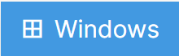

# Gridea Theme Bitcron Pro Plus

 
[中文版](./README.md) | [DEMO](https://bitcron.cf/) 
The original author of Bitcron Pro is [ `Yuxiang Qiu`](https://github.com/yuxqiu) Link to Bitcron Pro: <https://github.com/yuxqiu/bitcron-pro>
 
**Made without the authorization of the author**
 
***
## Features of Bitcron Pro:
1. Picture enlargement 
2. Reading time and word count of articles 
3. Toc directory support 
4. Dark mode 
5. Add more social styles 
6. Statistics of total visits to the website 
7. Conversion of complex and simplified forms 
8. Katex support (see [`This article`](https://blog.blinkstar.cn/post/katex/) for details) 
9. Add the function of displaying the cover 
10. Search function (using [ `Gridea-search open source project`](https://github.com/tangkaichuan/gridea-search), note: Gridea version 9.0 or above is required for normal use) 
11. Code highlighting 
12. Add a picture introduction 
...
## Added in Plus version:
1.Value Review System 
2.Live2D Kanban 
3.ALayer Music Player 
4.friend chain 
5.Web Pop-up 
6.More customization 
7.About 
8.CopyRight Information 
9.Better dark mode 
...
***
# How to use
## Download Gridea
First, you must have the [ `Gridea`](https://gridea.dev/) client 
 **What, you said you didn"t? (shocked**  
 (PS: If you've done this, please jump to [Installation Topics](#install-the-theme) )
Let"s download it first. 

 
The above is ghproxy accelerated download. If it fails, please use the[ Chinese storage ](https://www.123pan.com/s/eNgKVv-drlm) extraction code: `plus` After the download is completed, the installation does not need me to say more.

## Install the theme
After installing Gridea, go to [ `releases`](https://github.com/Wu-jiyan/gridea-theme-bitcron-pro-plus/releases) on this page to download the latest version or [ `use Ghproxy acceleration`](https://ghproxy.com/https://github.com/Wu-jiyan/gridea-theme-bitcron-pro-plus/releases/)
 
Then add the archive `unzip` to `C:\Users\%username%\Document\Gridea\themes` (the default folder) or to a folder you have customized in Gridea 

 
In Gridea, select a `Bitcron Pro Plus` theme 

 
**Well, that"s all for the tutorial, and let"s start a fun blog trip. **
 
(PS: If you like this theme, please give me a star~)

## Screenshots

